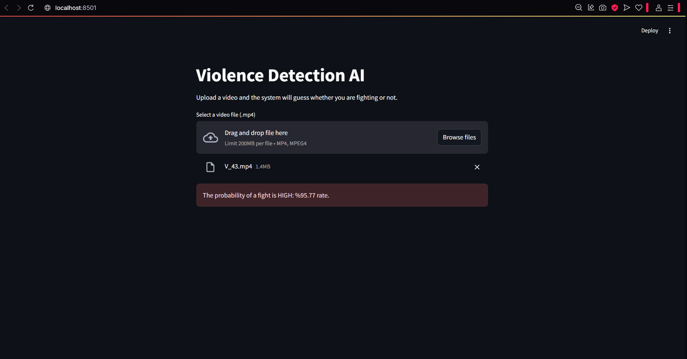

# Violence Detection AI

This project is a deep learning-based violence detection system that analyzes video footage and predicts whether a fight is occurring. A CNN model is trained on extracted video frames and a Streamlit interface allows users to upload and test any video.

---


---

## How It Works

- Videos are split into image frames (1 per second)
- A CNN is trained to classify violence vs non-violence images
- A Streamlit GUI loads the model and analyzes uploaded videos
- It outputs a probability score of whether the video contains violence

---

## Technologies Used

- Python
- TensorFlow / Keras
- OpenCV
- Streamlit
- NumPy

---

## Dataset

**The dataset is not included due to size and license.**
  Dataset Link: [Kaggle: Real Life Violence Situations Dataset] (https://www.kaggle.com/datasets/mohamedmustafa/real-life-violence-situations-dataset)

Expected structure:
```
dataset/
  violence/
    V_1.mp4
    V_2.mp4
    ...
  non_violence/
    NV_1.mp4
    NV_2.mp4
    ...
```
---
## Tasks Of Python Files

# training-model.py
This script trains a Convolutional Neural Network (CNN) on video frames 
to classify whether a scene contains violence or not.

Main tasks:
- Extracts frames from videos in "dataset/violence" and "dataset/non_violence"
- Applies image preprocessing and data augmentation
- Builds and trains a CNN using Keras
- Saves the trained model as "violence-detection-model.h5"

# gui.py
This file runs a Streamlit-based graphical user interface (GUI)
that allows users to upload a video and get a prediction.

Main tasks:
- Loads the trained model (.h5 file)
- Reads uploaded videos and extracts 1 frame per second
- Runs prediction on each frame and averages the results
- Displays a probability score indicating whether the video contains violence

---
## Preview




